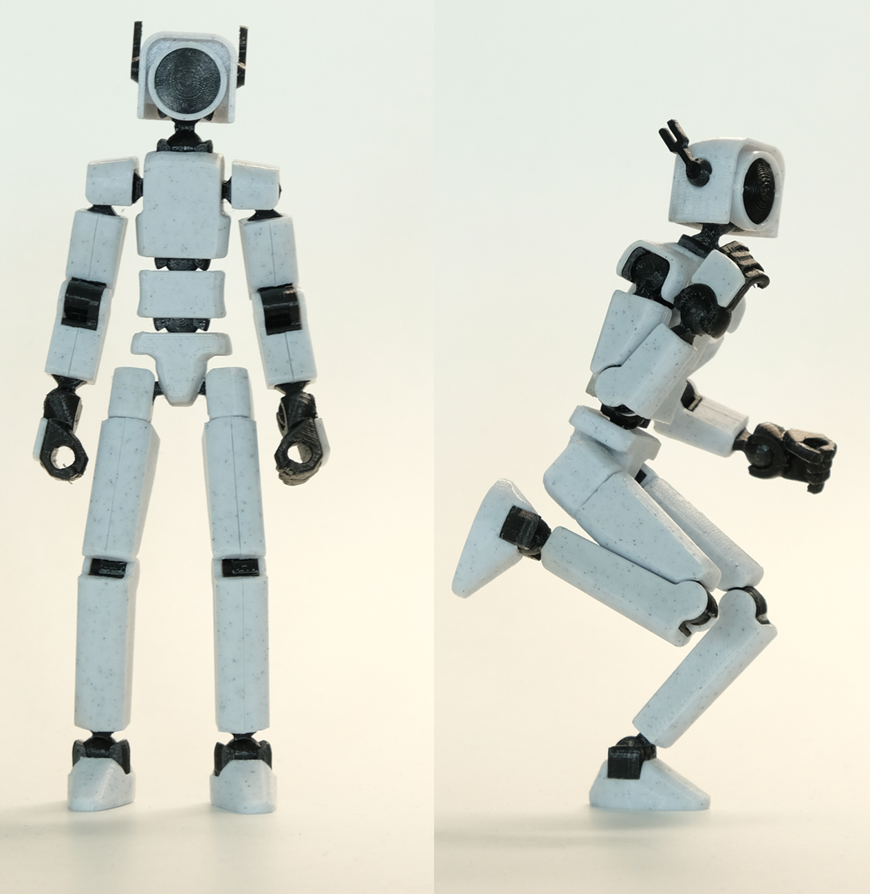
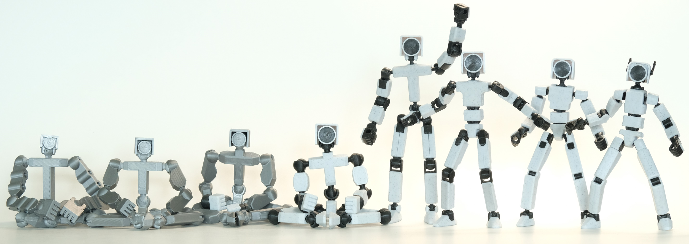

# Cupiter

Cupiter is a 3D Printable poseable action figure that resembles a robot. In this repository you'll find:
* [Printing and assembly instructions](instructions/README.md).
* The full [source code](src/README.md) for this project.

## About

I've been working on Cupiter off and on (mostly off) for several years. At first, my goal was just to create a very simple desk toy inspired by Lego Bionicles. My CAD skills improved as I worked on the project though, which inspired me to keep going and redesigning at my current skill level. It's still possible to take it further, but I'm happy with Cupiter as it is now and am ready to share with the world.

### Inspirations

* Lego Bionicles were some of my favorite toys growing up. The early designs of Cupiter were even lego-like, including pegs with snaps to attach additional parts, and simple ball and socket joints.
* Aaron Thomas' [Endo](https://www.toyforge.in/products/endo-the-skeleton). Endo is a more advanced project than mine, made by a more talented designer, but I did find it inspiring since if it was possible to push 3D printing this far, I knew what I was going for was achievable. This project heavily inspired the elbow and knee joints used for some of the middle versions of Cupiter.
* Soozafone's [Lucky 13](https://www.printables.com/model/148367-lucky-13-printable-jointed-figure). Lucky 13 came out a few years after I started this project and, after a mild round of despair having been beaten to the punch, it inspired me to revisit my work. Printing and assembling the two projects, you'll find the designs substantially different in construction, but I absolutely took visual cues from Lucky 13 like the second waist joint, posable shoulders, and more human-like proportions.

### Special Thanks

* I owe a lot to the developers and maintainers of [OpenSCAD](https://openscad.org/). It's been amazing having a project like this as a free resource.

## License
Source code and generated models are licensed under [CC-BY-4.0](https://creativecommons.org/licenses/by/4.0/).
