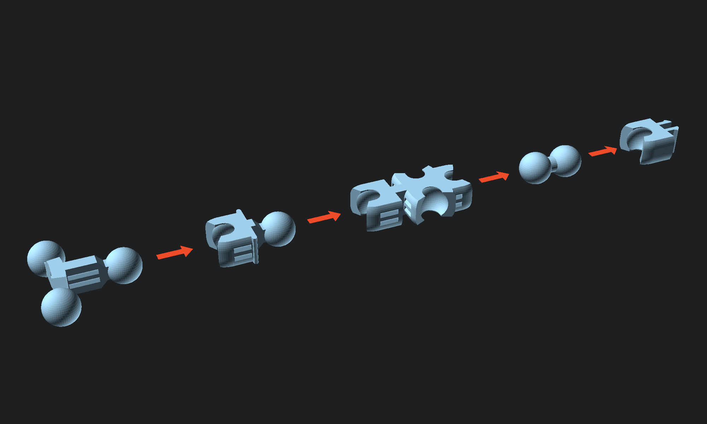
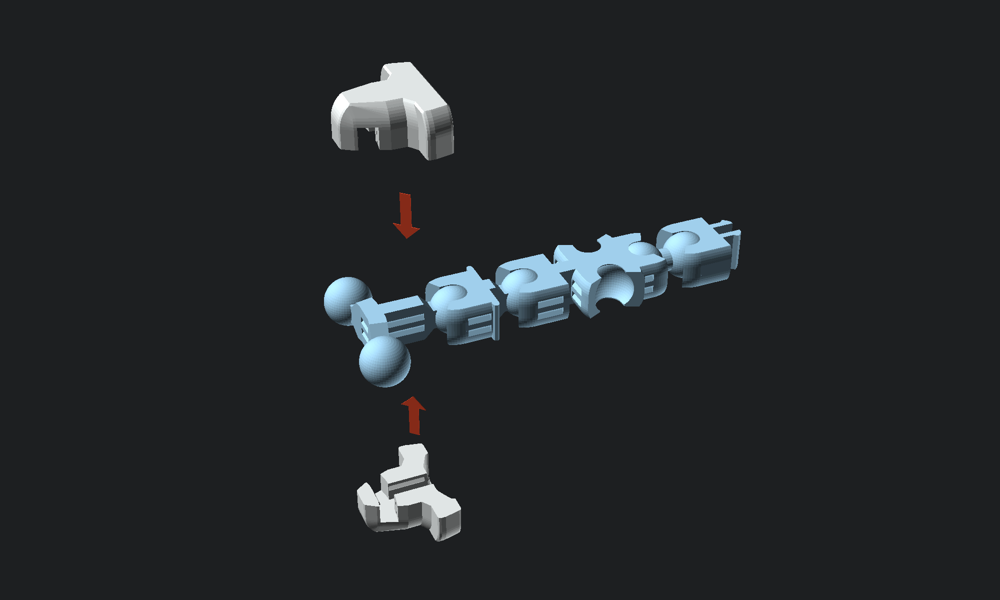
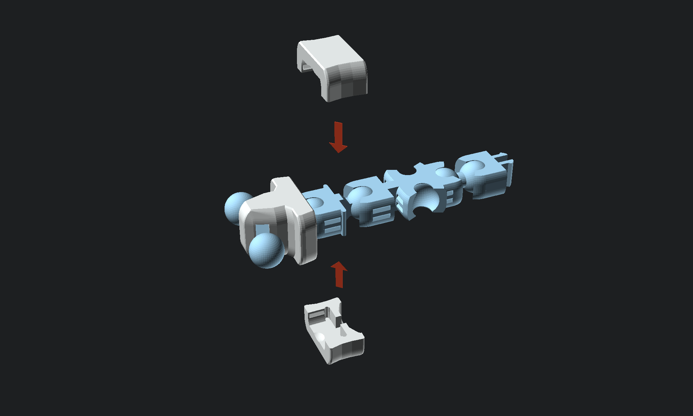
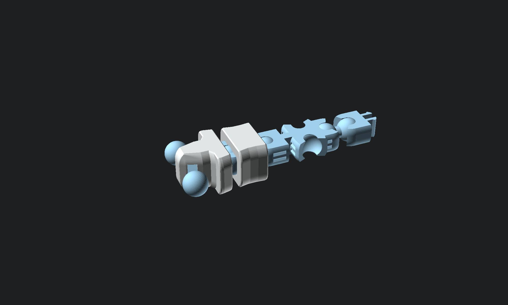

# Instructions

## Printing

This project is designed to be printed on standard consumer grade FDM printers with a 0.4mm nozzle and 0.15mm layer height. Most parts, with the exception of some hand options, should be printed without supports or brims for the best result.

PETG or similar filament is recommended. It may be possible to print some parts in PLA, however many parts will be too brittle for assembly, and the joints will loosen very fast because PLA deforms more under strain.

### Project Folders

The parts for this project are divided into a number of folders, some of which contain optional parts. If multiple copies of a part are needed, the folders will contain the correct number of copies, so you can simply plate all files in a given folder without worrying about adjusting the count of any parts.

The `frame` and `armor` folders contain all parts other than the hand options.
* `frame`
  * Contains the stick-figure frame for the robot, plus a couple additional parts like the lens for the eye which can look good printed in the same color. For best results, enable adaptive layer height for the lens if your slicer supports it.
* `armor`
  * Contains all the armor parts that clip over the frame.

The following hand parts are optional, and the best one to choose dependends on the capabilities of your printer. Pick at least one set of hands and hand armor.
* `hand_simple`
  * A blocky hand in a grip pose that is designed to print without supports.
* `hand_simple_armor`
  * Armor that goes on the back of the simple hand.
* `hand_complex_grip`
  * A more detailed hand in a grip pose. Requires supports to print; Organic supports will produce the best result.
* `hand_complex_armor`
  * Armor for the back of the complex hands. Print one set for each pair of complex hands you choose to print.
* `hand_complex_posed`
  * A series of alternate, more detailed hands in a variety of poses. Each pose has a right and left hand version so they can be mixed and matched. All options require supports to print; Organic supports will produce the best result.

## Assembly

All parts are designed to snap together or hold together using tension, and no tools or glue are needed for assembly.

Some parts can be much harder to assemble based on the order in which they are assembled. Following the steps below is recommended, or at least assembling the frame before attaching the armor.

### Assembly Tips

Snapping together the ball and socket joints is easier if you angle the flat side of the ball toward the edge of the socket.

Some parts look similar and it can be hard to tell the correct orientation. From left to right, the below image shows:
* The shoulder from the top.
* The shoulder from the bottom. Note the deeper cut on the socket. This part should face toward the armpit when the arm is assembled.
* The waist. Note the slightly longer stem on the ball, double snap indent, and cross-brace to prevent slipping.

### Arm Assembly

### Upper Body Assembly

### Leg Assembly

### Body Assembly

### Head Assembly

